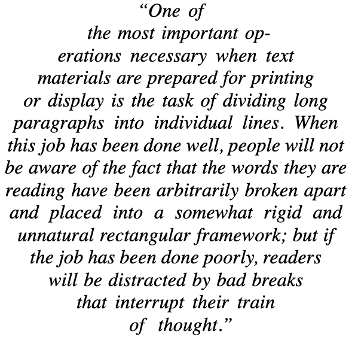

<p align="center"></p>

# tex-linebreak2 <sup><sup><i>(beta)</i></sup></sup>

[](https://opensource.org/licenses/MIT)


**tex-linebreak2** is a JavaScript library for breaking text into lines of optimal width. It can be used to lay out justified text as you
would find in a newspaper, book or technical paper. It implements the
[Knuth-Plass line-breaking algorithm](http://www.eprg.org/G53DOC/pdfs/knuth-plass-breaking.pdf)<sup>(PDF)</sup> which is used by [TeX](https://en.wikipedia.org/wiki/TeX).

**[See the demo](https://egilll.github.io/tex-linebreak2/)**.

This library can be used to lay out the text of webpages, plain text, or for rendering justified text to a canvas. <!--It can be used to find the optimal size of an element to fit text.-->

## Features

- Can be applied to webpages (with certain [limitations](#limitations-on-webpages)). Rendering the elements that are visible on screen usually does not take more than 40ms; rendering a very large document in its entirety may take 200ms.
- [Hanging punctuation](https://en.wikipedia.org/wiki/Hanging_punctuation)
- Breakpoints in accordance with the [Unicode line breaking algorithm](http://unicode.org/reports/tr14/).[^1]
- Supports custom breaking rules.
- Supports both justification and ragged alignment.
- Can be used in a browser or a Node.js environment[^2] to render to any target (`<canvas>`, HTML elements, PDF).

<!-- (*work in progress*) Can find the optimal width required for laying out text. This is especially useful when it comes to headlines (whose last line should not be mainly empty) but will also result in prettier output for general types of text.  -->

## Table of contents

- [Limitations](#limitations)
- [About the Knuth-Plass algorithm](#about-the-knuth-plass-algorithm)
- [Installation](#installation)
- [Usage](#usage)
- [Options](#options)
- [API](#api)
- [Hyphenation](#hyphenation)

## About the Knuth-Plass algorithm

Most text on the web is presented with "ragged-right" margins, as opposed to
the justified text you would find in e.g. a scientific paper or newspaper.
Text can be justified in web pages using `text-align: justify`.
However this option alone tends to result in large spaces
between words which is distracting to read. This is due to the
use of "first fit" line-breaking algorithms where the browser considers only the
current line when finding the next breakpoint. Some browsers support hyphenation
via `hyphens: auto` which reduces this effect. However the first-fit approach
can still produce wide lines and it can also produce more hyphenated lines than
necessary.

The Knuth-Plass algorithm on the other hand optimizes the spacing between words
over the whole paragraph, seeking to minimize the overall "badness" of the
layout. This factor depends on the amount by which spaces have been shrunk or
stretched and the number of hyphenated lines. The benefits of this approach are
greater when rendering narrower columns of text (eg. on small screens).

This table compares the same text rendered in the same environment (font, font
size, device width, margins) using CSS justification, CSS justification +
hyphenation and this library:

<table>
  <tr>
    <td align="center">Browser default<br/><sub>(text-align: justify)</sub></td>
    <td align="center">Browser default with hyphens<br/><sub>(text-align: justify; hyphens: auto)</sub></td>
    <td align="center"><i>tex-linebreak</i></td>
  </tr>
  <tr>
    <td align="center"></td>
    <td align="center"></td>
    <td align="center"></td>
  </tr>
  <tr>
    <td>CSS justification produces large spaces on the second and penultimate
        lines.</td>
    <td>Enabling hyphenation produces better output but still produces wide lines.</td>
    <td>The TeX algorithm in contrast hyphenates fewer lines and avoids
        excessive spacing between words.</td>
  </tr>
</table>

## Installation

### As a third-party script

When loaded as a third-party script, methods are available through the global variable `texLinebreak`.

```html
<head>
  <script src="https://unpkg.com/tex-linebreak2@0.8/dist/lib.js"></script>
</head>
<body>
  <p>Example text</p>
  <script>
    texLinebreak.texLinebreakDOM("p");
  </script>
</body>
```

### As a package

```sh
npm install tex-linebreak2
```

## Usage

### Webpages

Use the `texLinebreakDOM` function to lay out the paragraphs of a website:

```js
import { texLinebreakDOM } from "tex-linebreak2";

texLinebreakDOM("p"); // Selects all <p/> elements
```

The function accepts either a query selector string or a list of elements:

```js
import { texLinebreakDOM } from "tex-linebreak2";

texLinebreakDOM(document.querySelectorAll("p"), { align: "left" });
```

[Options](#options) are passed the second parameter of this function.

The library will listen for window resizing (can be turned off with the option `{ updateOnWindowResize: false }`, but it will not listen for dynamic DOM changes. If you alter the DOM in a way that may cause the available space for the paragraph to change, you must call `texLinebreakDOM` again.

#### Limitations on webpages

- ⚠️ A major limitation is that all line breaks are included in any text the user copies, and all hyphenated lines will include the hyphen character when copied.
- Underlined text will not have any underlines between words.
- Floating elements only have basic support:

  - All floating elements that are children of absolutely positioned or sticky elements are ignored.
  - Floating elements that are nested within the text itself (e.g. `<p>text <FloatingElement/> text</p>`) are not supported.
  - Floating elements that do not have `line-height` set are not supported.
  - If you run into layout issues and aren't using floating elements in your text, you can turn on the option `ignoreFloatingElements`.

- If you're using third-party webfonts, you must apply `texLinebreakDOM` after the fonts have fully loaded, and that may introduce a noticable lag.
- There may be issues regarding nested inline-block elements.
- Using `<br/>` instead of using new paragraph elements sometimes causes very wide spaces instead of optimal spacing, which is a bug.

The following are not supported:

- Columns
- Contenteditable elements
- The CSS properties `font-stretch`, `font-size-adjust`, and `font-kerning`

#### Other limitations

- Does not support Swedish, German, and Dutch hyphenation rules that cause spelling to change (e.g. _tuggummi_ becoming _tugg-gummi_ and _opaatje_ becoming _opa-tje_).

### Other types of text

```js
import { TexLinebreak } from "tex-linebreak2";

const text =
  "Chamæleon animal est quadrupes, macrum & gibbosum, capite galeato, corpore & cauda lacertæ majoris, cervice penè nulla, costis plus minus sedecim, obliquo ductu ventri junctis ut piscibus.";

const t = new TexLinebreak(text, {
  lineWidth: 45,
  /*
    A function that measures the width of a string of text.
    (For monospace text, you should however use the 
    option `preset: "plaintext"`, which will correctly 
    calculate a string's width)
  */
  measureFn: (word) => word.length,
  /* Spaces should not expand */
  glueStretchFactor: 0,
  /* Spaces should not contract */
  glueShrinkFactor: 0,
});

/* Get output as plain text */
console.log(t.plaintext);
/*
  Output:

  Chamæleon animal est quadrupes, macrum &
  gibbosum, capite galeato, corpore & cauda
  lacertæ majoris, cervice penè nulla, costis
  plus minus sedecim, obliquo ductu ventri
  junctis ut piscibus.
*/

/* Get output as positioned items */
console.log(t.lines.map((line) => line.positionedItems));
/*
  Output:

  [[{ type: 'box', text: 'Chamæleon', xOffset: 0, width: 9 },
    { type: 'glue', text: ' ', xOffset: 9, width: 1 },
    ...
*/
```

### Arbitrary items

You can also lay out arbitrary items (be it text or something else). The algorithm works with generic "box"
(typeset material), "glue" (spaces that may have flexible sizing) and "penalty" items.
Typically "boxes" are words, "glue" items are spaces and "penalty" items
represent hyphenation points or other possible breaking points. These concepts are more versatile than they may appear at first, as is discussed in the [original paper](#references).

```js
import { TexLinebreak, MIN_COST } from "tex-linebreak2";

const items = [
  { type: "box", width: 10 },
  { type: "glue", width: 4, stretch: 2, shrink: 1 },
  { type: "box", width: 20 },
  { type: "penalty", cost: MIN_COST },
];

const positionedItems = new TexLinebreak(items, {
  lineWidth: 45,
}).positionedItems;
```

## Options

See [`TexLinebreakOptions`](src/options.ts) for a list of available options. Of these, the most relevant ones are:

- `justify` (boolean)
- `align` ("left", "right", "center", default "left", does not need to be set on webpages)
- `hangingPunctuation` (boolean, default true)
- `glueStretchFactor` (default 1.2, i.e. becoming 220% of the space's original width) – How much a glue (space) is allowed to stretch. This is _not_ a hard limit; see `renderLineAsUnjustifiedIfAdjustmentRatioExceeds` for hard limits.
- `glueShrinkFactor` (default 0.2, i.e. becoming 80% of the space's original width) – How much a glue (space) is allowed to shrink. This is a hard limit.
- `softHyphenPenalty` (default 50) – Set to `MAX_COST` to prohibit breaking on soft hyphens.
- `forceOverflowToBreak` (default false) – Whether long words should be forcibly broken.
- `setElementWidthToMaxLineWidth` – Can be used to shrink a DOM element to the necessary width.
- `ignoreFloatingElements` – If you run into an issue where a floating element is interfering with the layout, and you're not using floating elements in the text, you can set this option to true.

## API

The class [`TexLinebreak`](src/index.ts) is used to break text into lines. It takes as input either text or [items](#arbitrary-items), along with [options](#options):

```js
new TexLinebreak("text", {});
// or
new TexLinebreak({ type: "box", width: 10 }, {});
```

It has the following properties:

- `lines` is an array of [`Line`](src/index.ts) objects which describe each line of the output
- `plaintext` will output the text as plain text with newlines
- `items`, the input text represented as boxes, glues, and penalties
- `breakpoints`, the indices of items that break a line

A [`Line`](src/index.ts) object describes a single line of the output. Its has the following properties:

- `positionedItems` – An array of the items (box, glue, and penalties) that are relevant for rendering the line (with irrelevant penalties having been removed and with irrelevant glue having been given a width of zero), along with their positioning information given as `xOffset` and `adjustedWidth` (which is width including any stretching or shrinking).
- `plaintext`

## Hyphenation

The recommended way to add hyphenation is to preprocess your text server-side and add [soft hyphen](https://en.wikipedia.org/wiki/Soft_hyphen) characters (`&shy;` in HTML, `\u00AD` in Unicode) to your text. This can be achieved with a library such as [Hyphen](https://github.com/ytiurin/hyphen). Client-side hyphenation will cause a noticable amount of lag on large documents.

_tex-linebreak2_ will strip the soft hyphen characters from the output so they won't be of annoyance to users who copy your text (can be turned off with the option `stripSoftHyphensFromOutputText`).

## Credits

This project is an extension of [tex-linebreak](https://github.com/robertknight/tex-linebreak) by [Robert Knight](https://github.com/robertknight).

## References

- D. E. Knuth and M. F. Plass, “[Breaking paragraphs into lines](http://www.eprg.org/G53DOC/pdfs/knuth-plass-breaking.pdf)” (PDF), _Software: Practice and Experience_, vol. 11, no. 11, pp. 1119–1184, Nov. 1981.

## Notes

[^1]: However there may exist a handful of exceptions regarding some non-Latin scripts.
[^2]: For Node.js, you do however have to supply your own function to measure the width of text. Furthermore, server-side processing of HTML documents is not supported out of the box.
