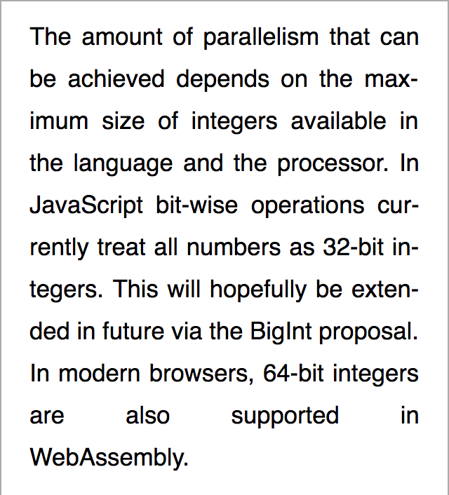

# tex-linebreak2
[](https://opensource.org/licenses/MIT)

<sub>(This repository is an extention of [tex-linebreak](https://github.com/robertknight/tex-linebreak) by Robert Knight.)</sub>

**tex-linebreak2** is a JavaScript library for breaking text into lines of optimal width. It can be used to lay out justified text as you
would find in a newspaper, book or technical paper. It implements the
[Knuth-Plass line-breaking algorithm](http://www.eprg.org/G53DOC/pdfs/knuth-plass-breaking.pdf)<sup>(PDF)</sup> which is used by [TeX](https://en.wikipedia.org/wiki/TeX).

**[Click here](#)** to see a demo.

This library can be used to lay out the text of webpages, plain text, or for rendering justified text to a canvas. It can be used to find the optimal size of an element to fit text.

## Table of contents

- [Features](#features)
- [About the Knuth-Plass algorithm](#about-the-knuth-plass-algorithm)
- [Bookmarklet](#bookmarklet)
- [Installation](#installation)
- [Usage](#usage)
- [Options](#options)
- [API](#api)
- [Hyphenation](#hyphenation)

## Features

- Can be applied to webpages (with certain [limitations](#limitations-on-webpages)) with decent performance (as long as hyphenation is not computed client-side)
- [Hanging punctuation](https://en.wikipedia.org/wiki/Hanging_punctuation)
- Breakpoints in accordance with the [Unicode line breaking algorithm](http://unicode.org/reports/tr14/).[^1]
- Supports custom breaking rules.
- Supports justification and ragged alignment.
- (*work in progress*) Can find the optimal width required for laying out text. This is especially useful when it comes to headlines (whose last line should not be mainly empty) but will also result in prettier output for general types of text. 
- Can be used in a browser or a Node.js environment[^2] to render to any target (`<canvas>`, HTML elements, PDF).

## About the Knuth-Plass algorithm

Most text on the web is presented with "ragged-right" margins, as opposed to
the justified text you would find in e.g. a scientific paper or newspaper.
Text can be justified in web pages using `text-align: justify`.
However this option alone tends to result in large spaces
between words which is distracting to read. This is due to the
use of "first fit" line-breaking algorithms where the browser considers only the
current line when finding the next breakpoint. Some browsers support hyphenation
via `hyphens: auto` which reduces this effect. However the first-fit approach
can still produce wide lines and it can also produce more hyphenated lines than
necessary.

The Knuth-Plass algorithm on the other hand optimizes the spacing between words
over the whole paragraph, seeking to minimize the overall "badness" of the
layout. This factor depends on the amount by which spaces have been shrunk or
stretched and the number of hyphenated lines. The benefits of this approach are
greater when rendering narrower columns of text (eg. on small screens).

This table compares the same text rendered in the same environment (font, font
size, device width, margins) using CSS justification, CSS justification +
hyphenation and this library:

<table>
  <tr>
    <td align="center">Browser default<br/><sub>(text-align: justify)</sub></td>
    <td align="center">Browser default with hyphens<br/><sub>(text-align: justify; hyphens: auto)</sub></td>
    <td align="center"><i>tex-linebreak</i></td>
  </tr>
  <tr>
    <td align="center"></td>
    <td align="center"></td>
    <td align="center"></td>
  </tr>
  <tr>
    <td>CSS justification produces large spaces on the second and penultimate
        lines.</td>
    <td>Enabling hyphenation produces better output but still produces wide lines.</td>
    <td>The TeX algorithm in contrast hyphenates fewer lines and avoids
        excessive spacing between words.</td>
  </tr>
</table>

## Bookmarklet

One way to see what the library can do is to [install the bookmarklet](bookmarklet.js) and activate it on an existing web page, such as this
[Medium article](https://medium.com/@parismarx/ubers-unrealistic-plan-for-flying-cars-6c9569d6fa8b).

It will justify and apply hyphenation to the content of any paragraph (`<p>`)
elements on the page. The difference is more beneficial on smaller screens,
so try it in your browser's responsive design mode.

Note that the bookmarklet does not work on sites that use
[Content Security Policy](https://developer.mozilla.org/en-US/docs/Web/HTTP/CSP)
to restrict where scripts can be loaded from.

## Installation

<!--
### As a third-party script

```html
<head>
  <script src="https://unpkg.com/tex-linebreak"></script>
  TODO...
</head>
<body>
  <p>Example text</p>
  <script>
    texLinebreak_lib.texLinebreakDOM("p", {
      hyphenateFn: new Hypher(enUsPatterns).hyphenate,
    });
  </script>
</body>
```
-->

### As a package

Add the _tex-linebreak2_ package to your dependencies:

```sh
npm install git+ssh://git@github.com/egilll/tex-linebreak2.git -s
```

## Usage

### Webpages

Use the `texLinebreakDOM` function to lay out the paragraphs of a website:

```js
import { texLinebreakDOM } from "tex-linebreak2";

texLinebreakDOM("p"); // Selects all <p/> elements
```

The function accepts either a query selector or a list of elements:

```js
import { texLinebreakDOM } from "tex-linebreak2";

const paragraphs = document.querySelectorAll("p");
texLinebreakDOM(document.querySelectorAll("p"), { align: "left" });
```

[Options](#options) are passed the second parameter of this function.

The library will listen for window resizing (can be turned off with the option `{ updateOnWindowResize: false }`, but it will not listen for dynamic DOM changes. If you alter the DOM in a way that may cause the available space for the paragraph to change, you must call `texLinebreakDOM` again.

#### Limitations on webpages

The library does not support:

- Floating elements that are nested within the text itself (e.g. `<p>text <FloatingElement> text</p>`)
- Floating elements when `line-height` isn't set
- Columns
- Contenteditable elements
- The CSS properties  `font-stretch`, `font-size-adjust`, and `font-kerning`

### Other types of text

```js
import { TexLinebreak } from "tex-linebreak2";

const text =
  "Chamæleon animal est quadrupes, macrum & gibbosum, capite galeato, corpore & cauda lacertæ majoris, cervice penè nulla, costis plus minus sedecim, obliquo ductu ventri junctis ut piscibus.";

const t = new TexLinebreak(text, {
  lineWidth: 45,
  /*
    A function that measures the width of a string of text.
    (For monospace text, you should however use the function `texLinebreakMonospace`)
  */
  measureFn: (word) => word.length,
  /* Spaces should not expand */
  glueStretchFactor: 0,
  /* Spaces should not contract */
  glueShrinkFactor: 0,
});

/* Get output as plain text */
console.log(t.plainText);
/*
  Output:
 
  Chamæleon animal est quadrupes, macrum &
  gibbosum, capite galeato, corpore & cauda
  lacertæ majoris, cervice penè nulla, costis
  plus minus sedecim, obliquo ductu ventri
  junctis ut piscibus.
*/

/* Get output as positioned items */
console.log(t.lines.map((line) => line.positionedItems));
/*
  Output:
 
  [[{ type: 'box', text: 'Chamæleon', xOffset: 0, width: 9 },
    { type: 'glue', text: ' ', xOffset: 9, width: 1 },
    ...
*/
```

### Arbitrary items

You can also lay out arbitrary items (be it text or something else). The algorithm works with generic "box"
(typeset material), "glue" (spaces that may have flexible sizing) and "penalty" items.
Typically "boxes" are words, "glue" items are spaces and "penalty" items
represent hyphenation points or other possible breaking points. These concepts are far more versatile than they may appear at first, as is discussed in the [original paper](#references).

```js
import { TexLinebreak, MIN_COST } from "tex-linebreak2";

const items = [
  { type: "box", width: 10 },
  { type: "glue", width: 4, stretch: 2, shrink: 1 },
  { type: "box", width: 20 },
  { type: "penalty", cost: MIN_COST },
];

const positionedItems = new TexLinebreak(items, {
  lineWidth: 45,
}).positionedItems;
```

## Options

See [`TexLinebreakOptions`](../src/options.ts) for a list of available options. Of these, the most relevant ones to a user are:

- `align` – Can be "justify", "left", "center", or "right". Default "justify".
- `hangingPunctuation` (boolean)
- `glueStretchFactor` (default 1.2, i.e. becoming 220% of the space's original width) – How much a glue (space) is allowed to stretch. This is _not_ a hard limit; see `renderLineAsLeftAlignedIfAdjustmentRatioExceeds` for hard limits.
- `glueShrinkFactor` (default 0.2, i.e. becoming 80% of the space's original width) – How much a glue (space) is allowed to shrink. This is a hard limit.
- `softHyphenPenalty` (default 50) – Set to 1000 to prohibit breaking on soft hyphens.
- `forceOverflowToBreak`
- `lineBreakingType`
- `setElementWidthToMaxLineWidth`

## API

The object [`TexLinebreak`](../src/index.ts) is used to break text. It takes as input either text or items along with options ([`TexLinebreakOptions`](../src/options.ts)):

```js
new TexLinebreak(text, {});
// or
new TexLinebreak(items, {});
```

It has the following properties:

- `lines` is an array of [`Line`](../src/index.ts) objects which describe each line of the output
- `plainText` will output the text as plain text
- `items`, the boxes, glues, and penalties that make up a paragraph
- `breakpoints` are the indices of items that break a line

A [`Line`](../src/index.ts) object describes a single line of the output. Its has the following properties:

- `positionedItems` – An array of each item (box, glue, and penalty) that is relevant for rendering the line (i.e. without irrelevant glues and penalties), along with their positioning information given as `xOffset` and `adjustedWidth` (width including any stretching or shrinking).

The following helper functions are available:

- `texLinebreakDOM`, used for websites
- `texLinebreakMonospace`, a wrapper that includes a string width measuring function for monospace text.

## Hyphenation

To hyphenate text, you can [Hypher](https://github.com/bramstein/hypher) library and pass it in as the `hyphenateFn` option like so:

```js
import { TexLinebreak } from "tex-linebreak2";
import Hypher from "hypher";
import enUsPatterns from "hyphenation.en-us";

new TexLinebreak(items, {
  hyphenateFn: new Hypher(enUsPatterns).hyphenate,
});
```

However, for websites it is highly recommended that you preprocess your text server-side (using a library such as [Hypher](https://github.com/bramstein/hypher) or [Hyphenopoly](https://github.com/mnater/Hyphenopoly)) and add [soft hyphen](https://en.wikipedia.org/wiki/Soft_hyphen) characters (`&shy;` in HTML, `\u00AD` in Unicode) to your text, since the hyphenation step introduces a noticable amount of lag.

## Contributors

Written by [Robert Knight](https://github.com/robertknight/tex-linebreak) with some modifications by Egill.

## References

- D. E. Knuth and M. F. Plass, “[Breaking paragraphs into lines](http://www.eprg.org/G53DOC/pdfs/knuth-plass-breaking.pdf)” (PDF), _Software: Practice and Experience_, vol. 11, no. 11, pp. 1119–1184, Nov. 1981.

## Notes

[^1]: However there may exist a handful of exceptions regarding some non-Latin scripts.
[^2]: For Node.js, you do however have to supply your own function to measure the width of text. Furthermore, server-side processing of HTML documents is not supported out of the box.
