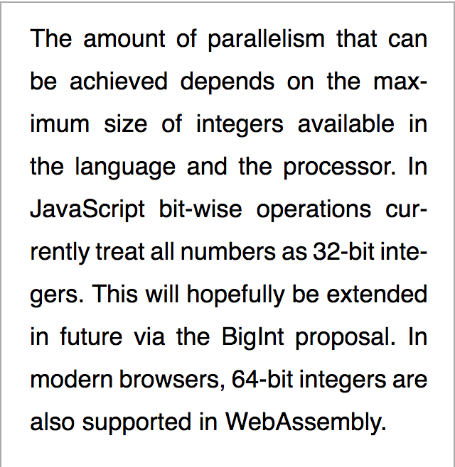

# tex-linebreak

[](https://opensource.org/licenses/MIT) 

_tex-linebreak_ is a JavaScript library for laying out justified text as you
would find in a newspaper, book or technical paper. It implements the
[Knuth-Plass line-breaking algorithm](#references), as used by [TeX](https://en.wikipedia.org/wiki/TeX).

**[Click here](#)** to see the a demonstration of this library.

Features:

- Can be applied to webpages (but see [caveats](#caveats)).
- Can be used for custom purposes (rendering to a canvas, getting plain text) in both browsers and Node.js environments.
- Hanging punctuation.
- Breakpoints in accordance with the [Unicode line breaking algorithm](http://unicode.org/reports/tr14/).[^1]

## WIP

Monospace

`Nulla ultricies, dolor in sagittis rutrum, nibh purus bibendum dui, nec aliquet ligula mi eget lectus. Nulla eget metus scelerisque, venenatis sapien ut, congue eros. Morbi convallis venenatis mauris, laoreet faucibus magna malesuada sed. Nulla consequat dignissim arcu non vestibulum. In commodo tristique scelerisque.`

## Introduction

Most text on the web is presented with "ragged-right" margins, as opposed to
the justified text you would find in e.g. a scientific paper or newspaper.
Text can be justified in web pages using `text-align: justify`.
However this option alone tends to result in large spaces
between words which is distracting to read. This is due to the
use of "first fit" line-breaking algorithms where the browser considers only the
current line when finding the next breakpoint. Some browsers support hyphenation
via `hyphens: auto` which reduces this effect. However the first-fit approach
can still produce wide lines and it can also produce more hyphenated lines than
necessary.

The Knuth-Plass algorithm on the other hand optimizes the spacing between words
over the whole paragraph, seeking to minimize the overall "badness" of the
layout. This factor depends on the amount by which spaces have been shrunk or
stretched and the number of hyphenated lines. The benefits of this approach are
greater when rendering narrower columns of text (eg. on small screens).

This table compares the same text rendered in the same environment (font, font
size, device width, margins) using CSS justification, CSS justification +
hyphenation and this library:

<table>
  <tr>
    <td>Safari: text-align: justify</td>
    <td>Chrome: text-align: justify; hyphens: auto</td>
    <td>_tex-linebreak_</td>
  </tr>
  <tr>
    <td></td>
    <td></td>
    <td></td>
  </tr>
  <tr>
    <td>CSS justification produces large spaces on the second and penultimate
        lines.</td>
    <td>Enabling hyphenation using `hyphens: auto` in browsers that support it
        (as of 2018-04-07 this appears to be only Chrome) produces better
        output but still produces wide lines.</td>
    <td>The TeX algorithm in contrast hyphenates fewer lines and avoids
        excessive spacing between words.</td>
  </tr>
</table>

_tex-linebreak_ has no dependencies on a particular JS environment (browser,
Node) or render target (`<canvas>`, HTML elements, PDF).

## Bookmarklet

The easiest way to see what the library can do is to [install the bookmarklet](bookmarklet.js) and activate it on an existing web page, such as this
[Medium article](https://medium.com/@parismarx/ubers-unrealistic-plan-for-flying-cars-6c9569d6fa8b).

It will justify and apply hyphenation to the content of any paragraph (`<p>`)
elements on the page. The difference is more beneficial on smaller screens,
so try it in your browser's responsive design mode.

Note that the bookmarklet does not work on sites that use
[Content Security Policy](https://developer.mozilla.org/en-US/docs/Web/HTTP/CSP)
to restrict where scripts can be loaded from.

## Usage

First, add the _tex-linebreak_ package to your dependencies:

```sh
npm install tex-linebreak
```

### Low-level APIs

The low-level APIs `breakLines` and `positionItems` work with generic "box"
(typeset material), "glue" (spaces with flexible sizing) and "penalty" items.
Typically "boxes" are words, "glue" items are spaces and "penalty" items
represent hyphenation points or the end of a paragraph. However you can use them
to lay out arbitrary content.

```js
import { TexLinebreak } from 'tex-linebreak';
const text =
  'Chamæleon animal est quadrupes, macrum & gibbosum, capite galeato, corpore & cauda lacertæ majoris, cervice penè nulla, costis plus minus sedecim, obliquo ductu ventri junctis ut piscibus.';
const output = new TexLinebreak(text, {
  lineWidth: 45,
  monospace: true,
}).getPlainText();

// Output:
// Chamæleon animal est quadrupes, macrum &
// gibbosum, capite galeato, corpore & cauda
// lacertæ majoris, cervice penè nulla, costis
// plus minus sedecim, obliquo ductu ventri
// junctis ut piscibus.
```

### Options

### Methods

### High-level APIs

The high-level APIs provide convenience methods for justifying content in
existing HTML elements and laying out justified lines for rendering to HTML,
canvas or other outputs. This includes support for hyphenation using the
[hypher](https://github.com/bramstein/hypher) library, but you can also .

#### Justifying existing HTML content

The contents of an existing HTML element can be justified using the
`justifyContent` function.

```js
import { justifyContent } from 'tex-linebreak';

justifyContent('p');
```

After an element is justified, its layout will remain fixed until `justifyContent`
is called again. In order to re-justify content in response to window size
changes or other events, your code will need to listen for the appropriate
events and re-invoke `justifyContent`.

#### Rendering text

For rendering justified text into a variety of targets (HTML, canvas, SVG,
WebGL etc.), the `layoutText` helper can be used to lay out justifed text and
obtain the positions which each word should be drawn at.

```js
const { positionedItems } = new TexLinebreak(text, {
  lineWidth: 300,
  measureFn: (word) => word.length * 5,
});

positionedItems.forEach((positionedItem) => {
  // Draw text as in the above example for the low-level APIs
});
```

## API reference

The source files in [src/](src/) have documentation in the form of TypeScript
annotations.

#

## References

- D. E. Knuth and M. F. Plass, “[Breaking paragraphs into lines](http://www.eprg.org/G53DOC/pdfs/knuth-plass-breaking.pdf)” (PDF), _Software: Practice and Experience_, vol. 11, no. 11, pp. 1119–1184, Nov. 1981.

**Notes**

[^1]: But see the comments regarding the option `preventSingleWordLines`.
[^2]: However there may exist a handful of exceptions regarding certain non-Latin scripts.
